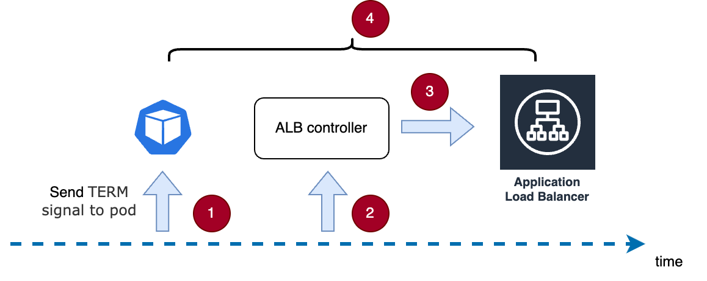

In an AWS EKS environment, using an ALB may lead to service downtime. The issue typically arises as follows:



**Time point 1:** When Kubernetes decides to remove a pod, it sends a TERM signal to the pod. The program either stops immediately or after completing all inflight requests. The pod's status is then marked as `Terminating`.

**Time poinr 2.** The ALB controller find the pod's status is terminating and try to remove the pod's IP from the ALB.

**Time point 3.** The ALB controller calls the relevant API to remove the pod's IP from the ALB.

As you can see, during this process, if any new requests arrive at the pod during Time Period 4, they will fail. This is a common issue, as described in this [GitHub issue](https://github.com/kubernetes-sigs/aws-load-balancer-controller/issues/2366).

The key point here is that the TERM signal should only be sent after the pod's IP has been removed from the ALB.

Here, we give you a solution, maybe it's not the best way, but it's a good practice.

We propose a solution that may not be perfect, but it's a good practice. By using a [preStop lifecycle hook](https://kubernetes.io/docs/concepts/containers/container-lifecycle-hooks/#container-hooks) in the deployment, the TERM signal will be delayed by 5 seconds, allowing the **Time Point 2/3** operations to complete.
```yaml
apiVersion: apps/v1
kind: Deployment
metadata:
  namespace: game-2048
  name: deployment-2048
spec:
  selector:
    matchLabels:
      app.kubernetes.io/name: app-2048
  replicas: 1
  template:
    metadata:
      labels:
        app.kubernetes.io/name: app-2048
    spec:
      containers:
      - image: public.ecr.aws/l6m2t8p7/docker-2048:latest
        imagePullPolicy: Always
        name: app-2048
        ports:
        - containerPort: 80
        lifecycle:
          preStop:
            exec:
              command: ["/bin/sh","-c","sleep 5"]
```
